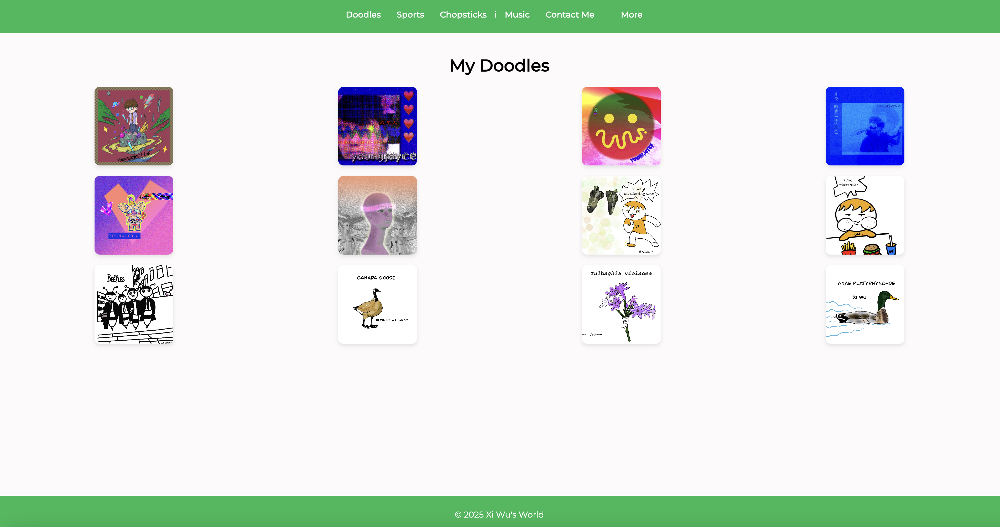
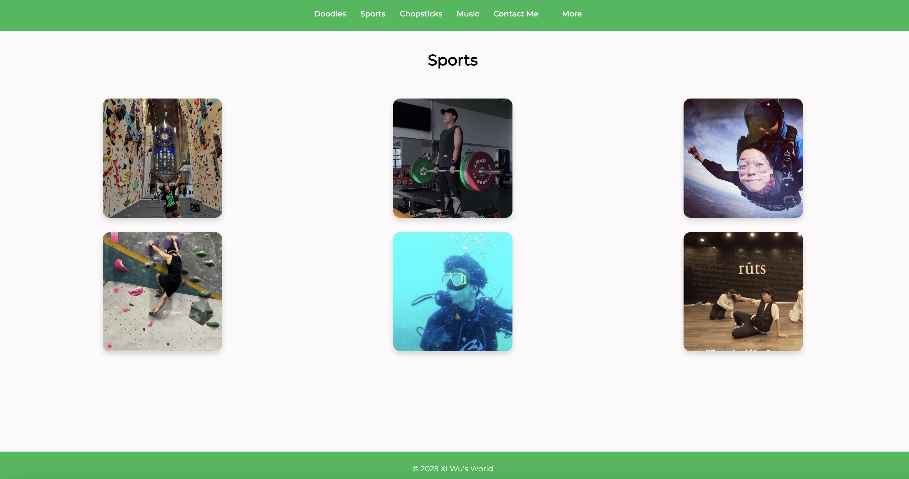
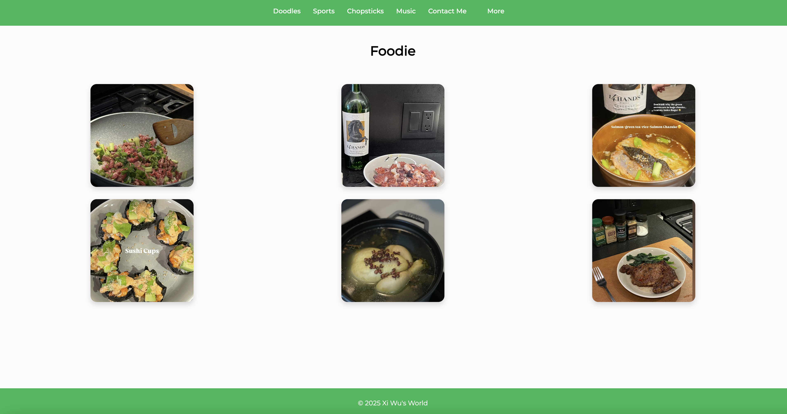
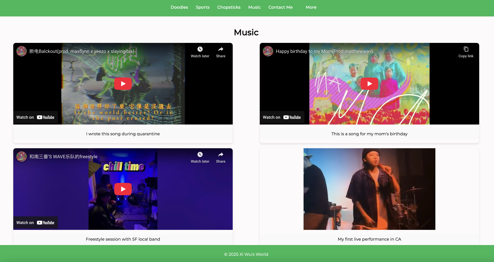
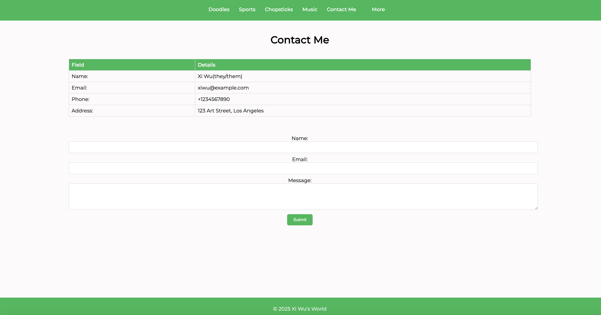
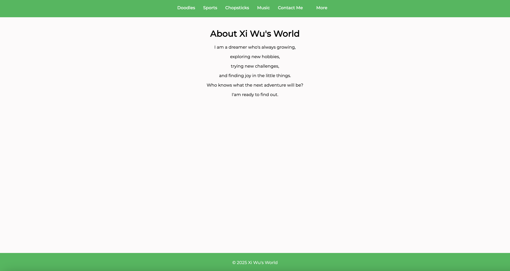
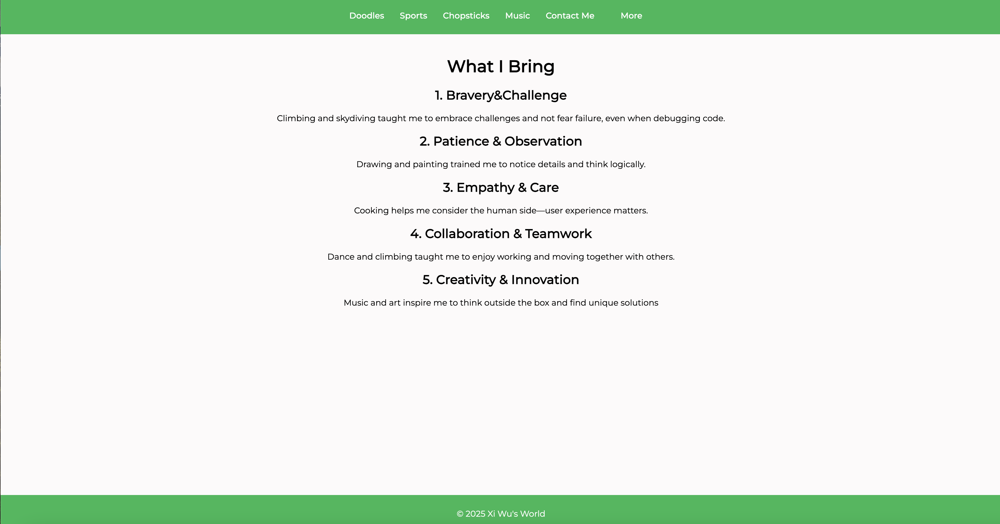

# My HTML Project

This is a simple HTML project. To view and run the HTML code in your browser, you need to use the **Live Server** extension in Visual Studio Code.

## How to Install Live Server

1. Open **Visual Studio Code**.
2. Go to the **Extensions** panel (you can press `Ctrl+Shift+X` or `Cmd+Shift+X` on Mac).
3. Search for **Live Server**.
4. Click **Install** on the Live Server extension by Ritwick Dey.

## How to Run the Project

1. Open this project folder in VS Code.
2. Right-click on the `index.html` file.
3. Select **Open with Live Server**.
4. Your default browser will open and display the HTML page.

## Webpages Screenshots

